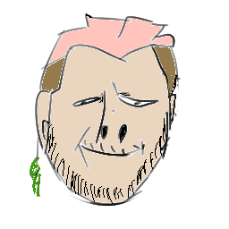

# Down Bad
## The Game
### Scenario
You are an Alazone employee. Your mission, if you accept it, is to save your son from the down bad at the hospital.

To achieve this, you can steal the contents of the boxes and resell the collected items. Beware of weight differences, Joff is adamant about weight differences.
### Mechanics
- Choose which box to open or not depending on the weight. 
- You have a limited inventory space, think about it.

## The Team
We are 5 young developers in 42lausanne doing our first game jam (that explains why our game is ugly and shit).
|Jerome|Leo|Victor|Quentin|Romain|
|:-:|:-:|:-:|:-:|:-:|
||||||

Many mechanics and alternative endings couldn't be implemented but that's the game I guess :')

## Credits
Shoutout to 
